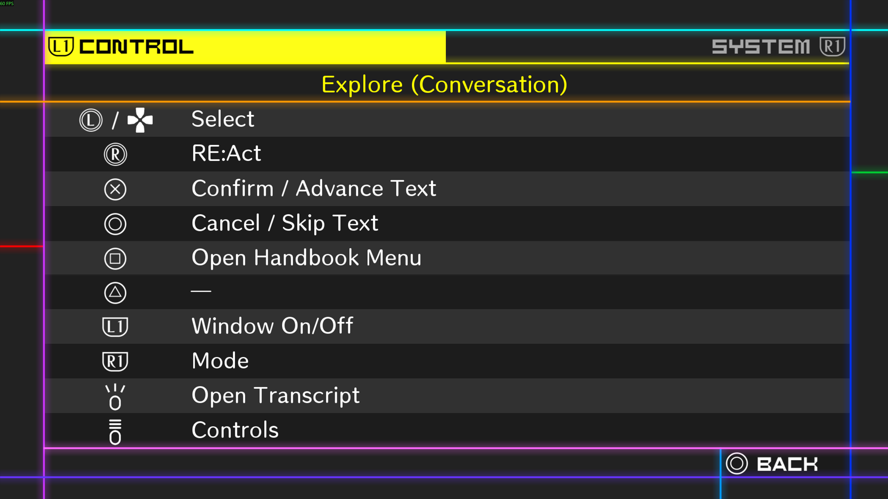

# Danganronpa V3 PlayStation Controller Icons

Replaces the Xbox-style controller icons in **Danganronpa V3: Killing Harmony** for PC with PlayStation-style icons. Includes DualSense and DualShock 4 variants; controller input is not changed.



## Requirements

- Steam version of Danganronpa V3 for Windows.
- Windows PowerShell 5.1 or newer.
- Python 3.9 or newer available as `python` on `PATH`.
- About 50 MB of free space.

## Installation

1. Download or clone this repository.
2. Put the repository folder directly inside the game folder (its name can differ):

   ```text
   Danganronpa V3 Killing Harmony\
   ├─ Dangan3Win.exe
   └─ <mod folder>\
      └─ DualSense_UI_Mod_Manager.bat
   ```

3. Close the game.
4. Run `DualSense_UI_Mod_Manager.bat`.
5. Choose **1** for DualSense Create/Options icons or **2** for DualShock 4 SHARE/OPTIONS icons.

Run the selected installer again after changing the game language to update the localized controller-help and Scrum Debate graphics.

## Uninstallation

Close the game, run `DualSense_UI_Mod_Manager.bat`, and choose **4**. If the compact rollback data is missing or invalid, use Steam's **Verify integrity of game files** option.

## Icon mapping

| Xbox/XInput | PlayStation display |
|---|---|
| A / B / X / Y | Cross / Circle / Square / Triangle |
| LB / RB | L1 / R1 |
| LT / RT | L2 / R2 |
| LS / RS movement | L / R stick icons |
| LS / RS click | L3 / R3 |
| View / Back | Create icon or SHARE |
| Menu / Start | Options icon or OPTIONS |

## Notes

- Shared runtime icons are language-independent. Controller-help and Scrum Debate graphics are patched for the currently active language.
- The controller-help illustration uses the game's shipped DualShock 4 artwork, not a custom DualSense controller drawing.
- The mod changes displayed controller graphics only; it does not change controller detection, button mappings, or input settings.
- For safety, the installer checks the game files it needs before writing and stops if they do not match a supported or previously installed state.
- This source-only repository contains no extracted game archives or official Sony artwork.
- Generated files and compact rollback data are stored in `DualSense_UI_Mod_Data`; do not redistribute that folder.

See [THIRD_PARTY_NOTICES.md](THIRD_PARTY_NOTICES.md) for format-research and tool acknowledgements.

## License

Code is licensed under GPL-3.0-or-later. The original Create/Options artwork in `assets/` is CC0-1.0. This unofficial fan project is not affiliated with Spike Chunsoft, Sony, or Valve.
